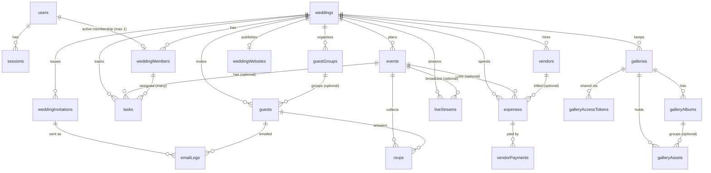

# Make My Marriage — Database Design Document

**Version:** 1.0
**Date:** 28 September 2026
**Status:** V1 database baseline
**Derived from:** *Make My Marriage — System Design Architecture Document V1.0*
**Database:** MongoDB Atlas · **ODM:** Mongoose · **Validation:** Zod

---

## Table of Contents

1. Purpose and Scope
2. Design Principles
3. Global Conventions
4. Collection Overview and ERD
5. Shared Sub-Schemas
6. Collection Specifications
7. Embed vs Reference Decisions
8. Indexing Strategy
9. Integrity and Consistency Rules
10. Soft Delete, Retention and Deletion Workflows
11. Data Classification and Public Projections
12. Mongoose Implementation Notes
13. Phase Mapping
14. Drawbacks, Limitations and Alternatives
15. Open Decisions for Product-Owner Approval
16. Architecture Compliance Check
17. Appendix A — Enum Reference
18. Appendix B — Example Documents

---

## 1. Purpose and Scope

### In plain words

The architecture document says *what* the system is made of. This document says *what the data looks like*: which collections (tables) exist, which fields each one holds, how they point at each other, and which indexes keep queries fast.

**Concrete example.** When Priya signs up, creates "Aarav & Diya's Wedding", and invites her mother Meena to help, the database ends up holding:

- 2 documents in `users` (Priya, Meena)
- 1 document in `weddings`
- 2 documents in `weddingMembers` (Priya as owner, Meena as member)
- 1 document in `weddingInvitations` (Meena's invitation, marked accepted)
- 1 document in `sessions` per logged-in browser

Every later feature (guests, events, expenses…) adds documents that all point back to that one wedding through `weddingId`.

### Scope

This document covers:

- All 20 collections named in Architecture §21, plus one **conditional** collection (`passwordResetTokens`, only if password reset ships in V1).
- Field definitions, validation rules, indexes, relationships, soft-delete behavior, retention, and data visibility.

This document does **not** cover: API contracts, UI, deployment, or the final role-permission matrix (Architecture §14 defers that to implementation).

### Source-of-truth rule

If this document ever conflicts with the System Design Architecture, the architecture wins and the conflict must be raised before changing anything (Architecture §55, rule 18). Places where this document *adds* to the architecture are listed in §16 so they can be approved explicitly.

---

## 2. Design Principles

Each principle is taken from the architecture and translated into a database rule.

| # | Architecture principle | Database rule |
|---|---|---|
| 1 | Wedding isolation (§3.4, §12) | Every wedding-owned document carries `weddingId`. No repository method for these collections may run without a `weddingId` filter. |
| 2 | MongoDB is the source of truth (§3.5) | No cached copies in Redis. Derived numbers (payment totals, RSVP counts) are computed from real documents, not duplicated, unless §9 says otherwise. |
| 3 | Files live in S3 (§3.6, §25) | Only metadata (object key, size, MIME type) is stored in MongoDB. Never file bytes. |
| 4 | Soft delete by default (§3.11, §24) | Business entities carry `deletedAt/deletedBy/deletionReason`. Hard delete is reserved for transient security data (sessions, expired tokens, stale upload records, old email logs). |
| 5 | One user = one wedding (§13) | Enforced in the service layer **and** by a database unique index (see `weddingMembers`). |
| 6 | Guests are not users (§16) | Guests are their own collection with no password fields. Access is by secure link token only. |
| 7 | No premature infrastructure (§3.1, §3.8) | No background jobs are needed for correctness: states like "expired" are *computed* from `expiresAt`, never flipped by a worker. Cleanup uses MongoDB TTL indexes. |
| 8 | Don't create collections without a query need (§21) | The collection list matches Architecture §21. Nothing extra is added except one conditional collection. |
| 9 | Indexes follow real query patterns (§22) | Every index in §8 is tied to a named query. |

---

## 3. Global Conventions

### 3.1 Naming

| Item | Convention | Example |
|---|---|---|
| Collection names | plural camelCase (as in Architecture §21) | `weddingMembers` |
| Field names | camelCase | `emailNormalized` |
| References | `<thing>Id` (single) or `<thing>Ids` (array) | `weddingId`, `assigneeMemberIds` |
| Enums | lowercase snake_case strings | `in_progress` |
| Model names (Mongoose) | singular PascalCase | `WeddingMember` |

### 3.2 Standard fields (every collection)

| Field | Type | Notes |
|---|---|---|
| `_id` | ObjectId | Default MongoDB id. It is an *identifier*, never a *secret* (Architecture §17). |
| `createdAt` | Date | Mongoose `timestamps: true` |
| `updatedAt` | Date | Mongoose `timestamps: true` (omitted on append-only collections such as `sessions`) |

### 3.3 Standard soft-delete block

Added to every business collection marked **Soft** in §4.

| Field | Type | Default | Notes |
|---|---|---|---|
| `deletedAt` | Date \| null | `null` | **Must be stored as an explicit `null`**, not left missing. Partial unique indexes in this design depend on it (see §14, item 3). |
| `deletedBy` | ObjectId (`users`) \| null | `null` | Who deleted it. |
| `deletionReason` | string \| null | `null` | Max 500 chars. Optional. |

### 3.4 Standard ownership and audit fields

| Field | Type | Applies to | Notes |
|---|---|---|---|
| `weddingId` | ObjectId (`weddings`) | Every wedding-owned collection | Required, indexed as the **first key** of nearly every compound index. |
| `createdBy` | ObjectId (`users`) | User-authored records | Points to `users._id`, which stays stable even if the membership is removed later. |

### 3.5 Data-type conventions

**Money — integers in minor units (paise), never decimals.**

- Example first: ₹1,50,000 is stored as `15000000` (paise). ₹499.50 is stored as `49950`.
- Why: floating-point numbers cannot represent most decimals exactly (`0.1 + 0.2 = 0.30000000000000004`). Adding up 200 expenses with floats can drift by a rupee. Integers do not drift.
- Field names end in `Minor` (e.g., `agreedAmountMinor`).
- Currency lives on the wedding (`weddings.currency`, default `INR`). **Limitation:** one currency per wedding. **Alternative:** add a per-expense `currency` later (NRI weddings with foreign vendors), at the cost of conversion logic.

**Instants vs calendar dates.**

- A moment in time (event start, payment time) → MongoDB `Date` in UTC.
- A calendar day with no time (wedding date, task due date) → string `"YYYY-MM-DD"`.
- Example first: a task due "10 February" should stay 10 February for everyone. If stored as a `Date`, someone in another timezone can see 9 February.
- **Drawback:** date-only strings can't use date operators without `$dateFromString`. **Alternative:** `Date` at 00:00 UTC. Rejected because it reintroduces the timezone shift bug.

**Timezones.** Events carry an IANA `timezone` string (default `Asia/Kolkata`), so a destination wedding abroad still displays correctly.

**Email.**

- `email` = as typed (for display). `emailNormalized` = trimmed + lowercased (for uniqueness and lookup).
- **Limitation:** no provider-specific rules (e.g., Gmail dots and `+tags` are *not* collapsed). Two spellings of the same Gmail inbox count as two accounts.

**Phone.** E.164 string (e.g., `+919876543210`). Zod validates; Mongoose stores as string.

**Text search.** `nameNormalized` (lowercase, trimmed, diacritics kept) is stored on `guests`, `guestGroups`, `vendors` for fast anchored-prefix search (`^pri`) using a normal index. **Limitation:** prefix search only, not "contains" or fuzzy search. **Alternative:** MongoDB Atlas Search (adds a search index; not in the architecture). Not V1.

**Tokens (secure links, invitations, sessions).**

1. Generate 32 bytes with `crypto.randomBytes` → base64url string. This is the token shown to the user.
2. Store `SHA-256(token)` as hex in a field named `tokenHash`. Lookups use the hash.
3. SHA-256 is acceptable here (unlike passwords) because the token is already 256 bits of randomness; there is nothing to brute-force.

**Passwords.** Stored as a structured object with algorithm, version, and parameters so the hashing cost can be upgraded later (Architecture §9). See `users`.

### 3.6 Enum handling

Enums are defined once in code (e.g., `src/lib/constants/enums.ts`) and imported by both the Zod schemas and the Mongoose schemas so they can never drift apart. Appendix A lists every enum.

### 3.7 Concurrency

Members edit the same wedding at the same time (a parent and the planner both editing the guest list). Collaborative collections use Mongoose `optimisticConcurrency: true`.

- Example first: Planner opens guest "Rahul" (version 3). Parent renames him to "Rahul Sharma" (version 4). Planner then saves an old copy. Without protection, the parent's change is silently lost. With optimistic concurrency, the planner's save fails and the API returns `409 CONFLICT`.
- Applies to: `tasks`, `guests`, `events`, `expenses`, `vendors`, `weddingWebsites`.
- **Drawback:** the client must handle 409 (reload and retry). **Alternative:** last-write-wins (simpler, but can silently lose edits).

---

## 4. Collection Overview and ERD

### 4.1 Collection catalog

| # | Collection | Module | Purpose | Delete strategy | Phase |
|---|---|---|---|---|---|
| 1 | `users` | users/auth | Login identities | Soft (+ later anonymize) | 1 |
| 2 | `sessions` | auth | Server-side login sessions | **Hard** (TTL) | 1 |
| 3 | `passwordResetTokens` *(conditional)* | auth | One-time reset tokens | **Hard** (TTL) | 1 |
| 4 | `weddings` | weddings | The wedding itself | Soft | 1 |
| 5 | `weddingMembers` | members | Who belongs to a wedding, with role | Soft | 1 |
| 6 | `weddingInvitations` | members | Invitations for people to *join* the planning team | **Hard** (TTL, after retention) | 1 |
| 7 | `events` | events | Mehendi, Haldi, Wedding, Reception… | Soft | 2 |
| 8 | `tasks` | tasks | To-dos, optionally per event, assigned to members | Soft | 2 |
| 9 | `guestGroups` | guest-groups | "Sharma Family", "College Friends" | Soft | 3 |
| 10 | `guests` | guests | People being invited | Soft | 3 |
| 11 | `rsvps` | rsvp | One row per guest per event: invited + response | Soft | 3 |
| 12 | `expenses` | expenses | Cost lines / budget items | Soft | 4 |
| 13 | `vendors` | vendors | Vendors the wedding hired or is considering | Soft | 4 |
| 14 | `vendorPayments` | expenses | Manually tracked payments | Soft | 4 |
| 15 | `weddingWebsites` | website | Public wedding website content | Soft | 5 |
| 16 | `liveStreams` | livestream | Stream links per wedding/event | Soft | 5 |
| 17 | `galleries` | gallery | Gallery container and upload settings | Soft | 6 |
| 18 | `galleryAlbums` | gallery | Albums inside a gallery | Soft | 6 |
| 19 | `galleryAssets` | gallery | Photo/video metadata (files are in S3) | Soft (+ TTL for stale pending uploads) | 6 |
| 20 | `galleryAccessTokens` | gallery | Shareable gallery/QR links | **Hard** (TTL, after revoke/expiry) | 6 |
| 21 | `emailLogs` | notifications | Per-recipient email results | **Hard** (TTL) | 3 |

(21 rows = the 20 collections in Architecture §21 + the conditional `passwordResetTokens`.)

### 4.2 Entity-relationship diagram



### 4.3 Relationship summary in plain words

- **One wedding is the root of everything.** Delete or hide the wedding and every guest, expense, and photo becomes unreachable.
- **A user can have at most one active membership**, and a wedding can have many memberships (the rule that makes "one user = one wedding, one wedding = many members" true).
- **Guests belong to the wedding, not to an event.** The link between a guest and an event is a row in `rsvps` (see §6.11 for why).
- **Expenses hold the cost; `vendorPayments` hold the money actually paid.** "How much is left to pay" is `agreed − sum(paid)`.

---

## 5. Shared Sub-Schemas

These are embedded documents reused by several collections. They are defined once so validation is identical everywhere.

### 5.1 `Address`

| Field | Type | Required | Rules |
|---|---|---|---|
| `line1` | string | No | ≤ 200 |
| `line2` | string | No | ≤ 200 |
| `city` | string | No | ≤ 100 |
| `state` | string | No | ≤ 100 |
| `postalCode` | string | No | ≤ 20. If `country = "IN"`, Zod requires 6 digits. |
| `country` | string | No | ISO 3166-1 alpha-2, default `"IN"` |

### 5.2 `Location`

Implements Architecture §27: never just a city string.

| Field | Type | Required | Rules |
|---|---|---|---|
| `label` | string | No | Venue/place name shown to people (e.g., "Grand Palace Banquet"). *Added; see §16.* |
| `address` | `Address` | No | |
| `coordinates.latitude` | number | No | −90 to 90 |
| `coordinates.longitude` | number | No | −180 to 180 |
| `placeId` | string | No | Google Places ID when the location came from Places |

**Rule:** `latitude` and `longitude` are both present or both absent (Zod refine).

**Why lat/lng are plain numbers and not GeoJSON:** MongoDB's geo queries (`$near`) need a GeoJSON `Point` and a `2dsphere` index. A wedding has *dozens* of vendors, not millions, so distance filtering is trivially done in application code (haversine formula). Adding a GeoJSON field and geo index now would be an index without a real query (violating Architecture §22). **Upgrade path:** when a cross-wedding geographic query is genuinely needed, add `location.geo = { type: "Point", coordinates: [longitude, latitude] }` with a migration script and a `2dsphere` index. Note the GeoJSON order is **[longitude, latitude]**.

**Google Places caching caveat:** Google's terms have historically restricted how long Places content (other than `placeId`) may be stored. Coordinates and addresses the *user typed or confirmed themselves* are the user's own data; content copied automatically from Places responses may be restricted. Verify Google's current terms before persisting Places-sourced fields long-term (open decision 8 in §15).

### 5.3 `SecureLink`

Used wherever a guest-facing link (`/invite/<token>`, `/rsvp/<token>`, `/live/<token>`) must be validated. Implements Architecture §17.

| Field | Type | Required | Notes |
|---|---|---|---|
| `tokenHash` | string | Yes | SHA-256 hex of the token. Used for lookup. |
| `tokenEnc` | string | Yes | Token encrypted with AES-256-GCM (`iv.authTag.ciphertext`, base64url). `select: false`. Lets members **re-display** the link. |
| `createdAt` | Date | Yes | |
| `expiresAt` | Date \| null | No | `null` = no expiry (allowed "where appropriate", Architecture §17) |
| `revokedAt` | Date \| null | No | Set on revoke or rotate |

**Why there are two token fields (important):**

- Example first: a member opens the guest list and taps "Share on WhatsApp" next to Rahul. The app must build `https://…/rsvp/<token>`. If only a *hash* is stored, the original token cannot be recovered, so the app can't rebuild the link; it could only mint a new token every tap, which silently breaks links already sent.
- The architecture says tokens are "stored hashed where practical". For guest links that members need to re-share repeatedly, pure hashing is not practical.
- **Recommended:** keep `tokenHash` for lookup and add `tokenEnc` (encrypted with a server-side key `TOKEN_ENCRYPTION_KEY`) for re-display. A database leak alone does not reveal usable links.
- **Drawback:** one extra secret (the encryption key) to manage; if the key leaks *and* the database leaks, links are exposed. **Alternative (architecture-pure):** hash only, and "Copy link" means "rotate and show once", meaning every rotation invalidates the previously sent link.
- Member-invitation and password-reset tokens (single-use, emailed once) stay **hash-only**.
- This is approval item 1 in §15.

**Lifecycle:** create → (optional) rotate (new token, old dies instantly) → revoke. A link is valid only if `revokedAt == null` **and** (`expiresAt == null` **or** `expiresAt > now`) **and** the owning wedding and owning record are not soft-deleted.

---
## 6. Collection Specifications

Each collection below follows the same layout: **in plain words** (with a concrete example), **fields**, **indexes**, **rules**, and **drawbacks/alternatives** where a real trade-off exists.

Legend for the "Req" column: ✔ required · — optional.

---

### 6.1 `users`

**In plain words.** One document per person who can log in. Example: Priya signs up with `Priya@Gmail.com` → one `users` document with `emailNormalized: "priya@gmail.com"`. If she later also clicks "Continue with Google", the Google identity is *added to the same document* rather than creating a second user.

| Field | Type | Req | Rules / Notes |
|---|---|---|---|
| `email` | string | ✔ | As typed, ≤ 254 |
| `emailNormalized` | string | ✔ | trim + lowercase. **Unique.** |
| `name` | string | ✔ | 1–100 chars |
| `passwordAuth` | object \| null | — | `null` for Google-only accounts. `select: false`. See below. |
| `passwordAuth.algorithm` | string | ✔ (if object) | `"scrypt"` |
| `passwordAuth.version` | int | ✔ (if object) | Bump when parameters change |
| `passwordAuth.params` | `{N, r, p, keyLen}` | ✔ (if object) | The exact scrypt parameters used for this hash |
| `passwordAuth.salt` | string | ✔ (if object) | Unique random salt (base64) |
| `passwordAuth.hash` | string | ✔ (if object) | Derived key (base64) |
| `passwordAuth.updatedAt` | Date | ✔ (if object) | |
| `authProviders[]` | array (max 5) | — | Linked external identities |
| `authProviders[].provider` | enum | ✔ | `google` |
| `authProviders[].providerUserId` | string | ✔ | Google's stable `sub` claim |
| `authProviders[].email` | string | — | Email Google reported at link time |
| `authProviders[].linkedAt` | Date | ✔ | |
| `status` | enum | ✔ | `active` (default), `disabled`, `pending_deletion` |
| `lastLoginAt` | Date \| null | — | |
| soft-delete block | | | §3.3 |

**Indexes**

| Index | Options | Serves |
|---|---|---|
| `{ emailNormalized: 1 }` | unique | Login lookup, signup duplicate check |
| `{ "authProviders.provider": 1, "authProviders.providerUserId": 1 }` | unique, partial `{ "authProviders.providerUserId": { $exists: true } }` | "Find the user for this Google account" |

**Rules**

1. Storing the hash *parameters with each hash* is what makes future upgrades possible: on next successful login, if `version` is old, re-hash with new parameters and save (Architecture §9).
2. There is deliberately **no `weddingId` on users**. Which wedding a user belongs to is answered by `weddingMembers` only (single source of truth). Cost: one extra indexed lookup per request. **Alternative:** cache `activeWeddingId` on `users`; faster but creates two places that can disagree.
3. **Security note caused by "no email verification" (Architecture §8).** Attack: someone signs up with *your* email and a password they choose. Later you click "Continue with Google". If the app silently links Google to the existing account, the attacker's password still works on your account ("pre-hijacking"). **Rule:** never auto-link a Google login to an existing *password* account unless the person proves the password (or the existing account has never been used). This is a service-layer rule, but the `authProviders` design makes it enforceable.
4. **Drawback of full unique on email:** a soft-deleted user's email stays reserved until anonymization (§10.4). **Alternative:** partial unique on active users only; rejected because it allows someone to register a deleted user's email and inherit references.

---

### 6.2 `sessions`

**In plain words.** One document per logged-in browser. Example: Priya logs in on her laptop and phone → 2 sessions. The browser holds a random token in a cookie; the database holds only its hash. Logging out sets `revokedAt`.

| Field | Type | Req | Rules / Notes |
|---|---|---|---|
| `userId` | ObjectId (`users`) | ✔ | |
| `tokenHash` | string | ✔ | SHA-256 hex of the cookie token. **Unique.** |
| `expiresAt` | Date | ✔ | Rolling expiry |
| `createdAt` | Date | ✔ | |
| `lastUsedAt` | Date | ✔ | |
| `revokedAt` | Date \| null | — | |
| `userAgent` | string | — | ≤ 300. Helps a "your active devices" screen. **IP addresses are intentionally not stored** (personal data, no V1 need). |

**Indexes**

| Index | Options | Serves |
|---|---|---|
| `{ tokenHash: 1 }` | unique | Every authenticated request |
| `{ userId: 1 }` | | "Revoke all sessions", password change |
| `{ expiresAt: 1 }` | **TTL**, `expireAfterSeconds: 0` | Auto hard-delete of expired sessions |

**Rules**

- Valid if `revokedAt == null` and `expiresAt > now`.
- **Write amplification:** updating `lastUsedAt` on *every* request means a database write on every click. Update it **only if older than ~10 minutes**.
- On password change or reset: revoke all sessions except the current one.
- **Limitation:** TTL deletion runs roughly every 60 seconds, so an expired session may exist briefly. That is why validity is *also* checked against `expiresAt` in code.
- **Drawback:** every request costs one DB read (vs. stateless JWT). **Alternative:** signed JWT sessions, which the architecture rejected in favor of revocable server-side sessions.

---

### 6.3 `passwordResetTokens` *(conditional; create only if password reset is in V1 scope)*

**In plain words.** A short-lived, single-use ticket. Example: Priya clicks "Forgot password", receives an email with a link containing a random token; the database stores only its hash.

| Field | Type | Req | Rules |
|---|---|---|---|
| `userId` | ObjectId (`users`) | ✔ | |
| `tokenHash` | string | ✔ | **Unique** |
| `expiresAt` | Date | ✔ | ≈ 30–60 minutes |
| `usedAt` | Date \| null | — | Set on use; reject if already set |
| `createdAt` | Date | ✔ | |

**Indexes:** unique `tokenHash`; `{ userId: 1 }`; TTL on `expiresAt` (`expireAfterSeconds: 0`).

**Rules:** mark used with an atomic `findOneAndUpdate({ tokenHash, usedAt: null, expiresAt: { $gt: now } })` so two clicks cannot both succeed. On success, revoke all of the user's sessions. Never log the token.

---

### 6.4 `weddings`

**In plain words.** The wedding itself, the root every other record points to. Example: "Aarav & Diya's Wedding", planned for 14 February 2027, in Surat.

| Field | Type | Req | Rules / Notes |
|---|---|---|---|
| `title` | string | ✔ | 1–120 |
| `partners[]` | array (max 2) of `{ name }` | — | `name` 1–80. Kept as neutral "partners" so the model works for any couple. |
| `weddingDate` | string `YYYY-MM-DD` \| null | — | Main date; may be undecided at creation |
| `timezone` | string | ✔ | IANA, default `Asia/Kolkata` |
| `currency` | string | ✔ | ISO 4217, default `INR` |
| `location` | `Location` | — | Overall city/venue area |
| `budgetTotalMinor` | int \| null | — | ≥ 0 |
| `status` | enum | ✔ | `planning` (default), `completed`, `archived` |
| `createdBy` | ObjectId (`users`) | ✔ | |
| `purgeAfter` | Date \| null | — | Set when soft-deleted; earliest time permanent cleanup may run (§10.3) |
| soft-delete block | | | §3.3 |

**Indexes**

| Index | Options | Serves |
|---|---|---|
| `{ purgeAfter: 1 }` | partial `{ purgeAfter: { $type: "date" } }` | Cleanup script finds weddings past their grace period |

(Wedding lookup is always by `_id`, which is already indexed.)

**Rules**

- **There is no `ownerUserId` here.** The owner is the `weddingMembers` row with `role: "owner"`. One source of truth. Exactly one active owner per wedding is enforced by an index on `weddingMembers` (§6.5).
- Every request path resolves: session → user → membership → wedding, and rejects if `wedding.deletedAt != null`.

---

### 6.5 `weddingMembers`

**In plain words.** The link between a person and a wedding. Example: Priya (owner, "couple"), Meena (member, "parent"), Kavita (admin, "planner"). This collection is what makes "one user = one wedding" enforceable.

| Field | Type | Req | Rules / Notes |
|---|---|---|---|
| `weddingId` | ObjectId | ✔ | |
| `userId` | ObjectId (`users`) | ✔ | |
| `role` | enum | ✔ | `owner`, `admin`, `member`. **Controls permissions.** |
| `relationship` | enum | — | `couple`, `parent`, `sibling`, `relative`, `friend`, `planner`, `other`. **Display label only, controls nothing.** *Added; see §16.* |
| `status` | enum | ✔ | `active` (default), `suspended` |
| `invitedBy` | ObjectId (`users`) \| null | — | |
| `joinedAt` | Date | ✔ | |
| soft-delete block | | | §3.3 |

Why both `role` and `relationship`? The architecture's example tree shows "Couple / Parent / Sibling / Wedding Planner", but its role list is `owner/admin/member`. They answer different questions: *what may this person do* (role) vs. *who are they to the couple* (relationship). Mixing them would make "Parent" a permission level.

**Indexes**

| Index | Options | Serves / enforces |
|---|---|---|
| `{ userId: 1 }` | **unique**, partial `{ deletedAt: { $type: "null" } }` | **One user = one active wedding.** A second active membership is rejected by the database itself. |
| `{ weddingId: 1 }` | | List a wedding's members |
| `{ weddingId: 1, role: 1 }` | **unique**, partial `{ role: "owner", deletedAt: { $type: "null" } }` | **Exactly one active owner per wedding** |

**Rules**

1. Leaving or removing a member = soft delete. This frees the user to join another wedding later, because the unique index ignores soft-deleted rows. A returning user gets a *new* row.
2. The owner cannot leave or be removed without transferring ownership first. Transfer runs in a transaction: demote old owner → promote new owner (in that order so the owner-unique index never sees two).
3. Duplicate-key error (`E11000`) on `userId` is mapped to `409 CONFLICT` with code `ALREADY_IN_WEDDING`.
4. When a member is removed, tasks assigned to them are cleaned (`$pull` from `assigneeMemberIds`).
5. **Suspended** members remain "in" the wedding (still occupy the one-wedding slot) but fail authorization.

**Drawback:** the unique-plus-soft-delete design depends on `deletedAt` being an explicit `null`. A document inserted without it (e.g., by a manual script) would be missing from the partial index and could bypass the rule. **Alternatives:** (a) an `isActive` boolean used in the filter (harder to forget, redundant with `deletedAt`); (b) hard-delete membership rows and keep history elsewhere (adds a collection the architecture excludes).

---

### 6.6 `weddingInvitations`

**In plain words.** An invitation for someone to *join the planning team* (not a guest invitation). Example: Priya enters `meena@example.com`; the app creates this document and emails a link with a random token. When Meena signs up and accepts, the invitation is marked accepted and a `weddingMembers` row is created.

| Field | Type | Req | Rules / Notes |
|---|---|---|---|
| `weddingId` | ObjectId | ✔ | |
| `invitedBy` | ObjectId (`users`) | ✔ | |
| `email` / `emailNormalized` | string | ✔ | Invitee address |
| `role` | enum | ✔ | `admin` or `member` (never `owner`) |
| `relationship` | enum | — | Same list as `weddingMembers.relationship` |
| `message` | string | — | ≤ 500 personal note |
| `tokenHash` | string | ✔ | **Hash only** (single-use, emailed once) |
| `status` | enum | ✔ | `pending`, `accepted`, `revoked`. **"Expired" is not stored.** |
| `expiresAt` | Date | ✔ | e.g., created + 7 days |
| `acceptedAt` / `acceptedBy` | Date / ObjectId | — | |
| `revokedAt` / `revokedBy` | Date / ObjectId | — | |
| `purgeAt` | Date | ✔ | Hard-delete time; see rules |

**Why "expired" isn't a status:** flipping `pending → expired` would need a background job (excluded in V1). Instead, code checks `status == pending && expiresAt > now`. No job needed.

**Indexes**

| Index | Options | Serves |
|---|---|---|
| `{ tokenHash: 1 }` | unique | Open invitation link |
| `{ weddingId: 1, status: 1, createdAt: -1 }` | | "Pending invitations" list |
| `{ weddingId: 1, emailNormalized: 1 }` | unique, partial `{ status: "pending" }` | No two pending invites for the same email in one wedding |
| `{ purgeAt: 1 }` | **TTL**, `expireAfterSeconds: 0` | Hard delete of old records |

**Rules**

1. `purgeAt` = `expiresAt + 30 days` at creation; on accept/revoke set to `now + 30 days`. This keeps a short audit trail, then removes security-sensitive rows (Architecture §24 hard-delete candidates).
2. **Accept flow (transaction, Architecture §23):**
   1. Atomically claim: `findOneAndUpdate({ tokenHash, status: "pending", expiresAt: { $gt: now } }, { $set: { status: "accepted", acceptedAt, acceptedBy } })`. If null → reject (expired/used/revoked).
   2. Create the `weddingMembers` row. If the user already has an active membership, the unique index throws → the transaction aborts → the invitation stays `pending`.
3. **Edge case:** the partial unique index counts an *expired-but-still-`pending`* invite as pending. Re-inviting the same email must therefore revoke/replace the stale row in the same operation.
4. Per Architecture §15, the token itself authorizes the join (no email-match requirement), so `emailNormalized` is informational and for duplicate prevention. **Limitation:** anyone who obtains the link can join as the invited role; mitigated by single use, expiry, and revocation.

---

### 6.7 `events`

**In plain words.** A function within the wedding. Example: "Haldi", 13 Feb 2027, 10:00–13:00, at the family home, dress code yellow.

| Field | Type | Req | Rules / Notes |
|---|---|---|---|
| `weddingId` | ObjectId | ✔ | |
| `name` | string | ✔ | 1–120 |
| `type` | enum | ✔ | `mehendi`, `haldi`, `sangeet`, `engagement`, `ceremony`, `reception`, `other`. `ceremony` = the main wedding ceremony. |
| `startsAt` | Date | ✔ | UTC instant |
| `endsAt` | Date \| null | — | Must be > `startsAt` |
| `timezone` | string | ✔ | IANA, defaults from wedding |
| `location` | `Location` | — | |
| `description` | string | — | ≤ 2000 |
| `dressCode` | string | — | ≤ 200 |
| `sortOrder` | int | — | Manual ordering tie-breaker |
| `isPublic` | boolean | ✔ | Default `false`. Whether the wedding website may show it (§6.15). |
| `schedule[]` | array (max 50) | — | *Added 2026-10-10 (owner decision).* The event's timed run-of-show, embedded because it is always read with its event and never queried across weddings. Each line: `{ _id, time, title, notes?, isPublic }`; `time` is a 24-hour `"HH:mm"` wall-clock string in the event's `timezone`; `isPublic` is for the §6.15 website. Not a task: a task is a to-do for a person. |
| `createdBy` | ObjectId | ✔ | |
| soft-delete block | | | |

**Indexes:** `{ weddingId: 1, startsAt: 1 }` (timeline; also covers the architecture's plain `weddingId` index as a prefix).

**Rules**

- Soft-deleting an event soft-deletes its `rsvps` rows in the same transaction and sets `eventId: null` on its tasks/expenses (they are not deleted; they become wedding-level).
- Event ids referenced by other documents must belong to the same wedding (§9.2).

---

### 6.8 `tasks`

**In plain words.** A to-do. Example: "Book the mandap decorator", due 1 Jan 2027, linked to the Wedding event, assigned to Meena and Kavita.

| Field | Type | Req | Rules / Notes |
|---|---|---|---|
| `weddingId` | ObjectId | ✔ | |
| `eventId` | ObjectId \| null | — | `null` = wedding-level task |
| `title` | string | ✔ | 1–200 |
| `description` | string | — | ≤ 2000 |
| `status` | enum | ✔ | `todo` (default), `in_progress`, `done` |
| `priority` | enum | ✔ | `low`, `medium` (default), `high` |
| `dueDate` | string `YYYY-MM-DD` \| null | — | |
| `assigneeMemberIds[]` | ObjectId[] (`weddingMembers`) | — | Max 10. Points to **membership** ids. |
| `completedAt` / `completedBy` | Date / ObjectId | — | Set when status becomes `done`, cleared otherwise |
| `createdBy` | ObjectId | ✔ | |
| soft-delete block | | | |

**Indexes**

| Index | Serves |
|---|---|
| `{ weddingId: 1, status: 1, dueDate: 1 }` | Main task board / "what's due soon" |
| `{ weddingId: 1, eventId: 1 }` | Tasks for one event |
| `{ weddingId: 1, assigneeMemberIds: 1 }` (multikey) | "My tasks" |

**Rules**

- Assignees must be **active members of the same wedding** (checked in service).
- Why membership ids instead of user ids: an assignment is "a role in this wedding", and validating "is this assignee in *this* wedding" is a direct lookup.
- **Limitation:** no subtasks, comments, or recurrence in V1. **Alternative:** a `checklist[]` sub-array (bounded) if subtasks are needed later.

---
### 6.9 `guestGroups`

**In plain words.** A bucket for organizing guests. Example: "Sharma Family" (partner one's side), "College Friends" (partner two's side). Useful for headcounts and for sending invitations family by family.

| Field | Type | Req | Rules / Notes |
|---|---|---|---|
| `weddingId` | ObjectId | ✔ | |
| `name` / `nameNormalized` | string | ✔ | 1–100 |
| `side` | enum | ✔ | `partnerOne`, `partnerTwo`, `both`. UI shows the partners' actual names from `weddings.partners`. |
| `notes` | string | — | ≤ 1000, private |
| `sortOrder` | int | — | |
| soft-delete block | | | |

**Indexes:** `{ weddingId: 1, nameNormalized: 1 }` unique, partial `{ deletedAt: { $type: "null" } }` (no duplicate group names).

**Rules:** deleting a group requires the caller to choose: *unassign its guests* (`groupId: null`) or *move them to another group*. Guests are never silently deleted with the group.

---

### 6.10 `guests`

**In plain words.** A person being invited who is **not** an app user. Example: "Rahul Sharma", cousin, phone `+919876543210`, in group "Sharma Family", vegetarian, one plus-one allowed.

| Field | Type | Req | Rules / Notes |
|---|---|---|---|
| `weddingId` | ObjectId | ✔ | |
| `groupId` | ObjectId \| null | — | → `guestGroups`, same wedding |
| `name` / `nameNormalized` | string | ✔ | 1–120 |
| `email` | string \| null | — | Lowercased |
| `phone` | string \| null | — | E.164 |
| `address` | `Address` | — | For physical invitations |
| `side` | enum | ✔ | `partnerOne`, `partnerTwo`, `both` |
| `relationLabel` | string | — | ≤ 80 free text ("College friend") |
| `ageCategory` | enum | ✔ | `adult` (default), `child`, `infant`. Useful for catering counts. |
| `plusOnesAllowed` | int | ✔ | 0–10, default 0 |
| `dietaryPreference` | enum | — | `no_preference`, `vegetarian`, `non_vegetarian`, `vegan`, `jain`, `other` |
| `notes` | string | — | ≤ 1000, **private** (never sent to guests) |
| `invitation` | object | ✔ | `{ status: not_invited \| invited, lastSentAt, lastChannel: email \| whatsapp \| manual, sendCount }` |
| `link` | `SecureLink` \| null | — | The guest's personal RSVP/invite token (§5.3) |
| `createdBy` | ObjectId | ✔ | |
| soft-delete block | | | |

**Indexes**

| Index | Options | Serves |
|---|---|---|
| `{ weddingId: 1, nameNormalized: 1, _id: 1 }` | | Alphabetical cursor pagination + prefix search |
| `{ weddingId: 1, groupId: 1 }` | | Guests of a group |
| `{ weddingId: 1, phone: 1 }` | sparse | Duplicate detection when importing |
| `{ "link.tokenHash": 1 }` | unique, partial `{ "link.tokenHash": { $exists: true } }` | Open `/rsvp/<token>` |

**Rules**

1. **Overall RSVP state is not stored on the guest.** "Has Rahul replied?" is answered from `rsvps` (§6.11). Duplicating it here would create two places to keep in sync.
2. Token validation (`/rsvp/<token>`) checks: guest exists, `deletedAt == null`, link not revoked/expired, **and the wedding is not soft-deleted**.
3. Soft-deleting a guest sets `link.revokedAt` and soft-deletes their `rsvps` (transaction).
4. `invitation.status` is a *summary of what the sender did*. For WhatsApp (no API, Architecture §31) it means "the member tapped share"; the app cannot know if it was actually sent.
5. **Limitation:** one link per guest, not per household. If a family of five shares one WhatsApp message, each person needs their own link. **Alternative:** a group-level link that lets one person answer for the whole `guestGroups` document. Not V1 (approval item 4, §15).
6. **Limitation:** no full-text "contains" search (see §3.5).

---

### 6.11 `rsvps`

**In plain words.** One row per **guest per event**. It does two jobs at once:

1. **Assignment:** the row's existence means "this guest is invited to this event".
2. **Response:** the row's `status` says whether they replied.

**Concrete example.** Rahul is invited to Haldi and Reception but not Mehendi → 2 rows. Both start as `pending`. When Rahul opens his link and answers "Haldi: yes, 2 people; Reception: no", the rows become `attending (2)` and `declined`.

| Field | Type | Req | Rules / Notes |
|---|---|---|---|
| `weddingId` | ObjectId | ✔ | |
| `guestId` | ObjectId | ✔ | → `guests` |
| `eventId` | ObjectId | ✔ | → `events` |
| `status` | enum | ✔ | `pending` (default), `attending`, `declined`, `maybe` |
| `attendingCount` | int | ✔ | Total people attending **including the guest**. `0` unless `attending`/`maybe`. Must be ≤ `1 + guest.plusOnesAllowed`. |
| `respondedAt` | Date \| null | — | |
| `respondedVia` | enum \| null | — | `guest_link`, `member` (a member entered it manually, e.g., after a phone call) |
| `respondedByUserId` | ObjectId \| null | — | Set when `member` |
| `note` | string | — | ≤ 500 message from the guest |
| soft-delete block | | | |

**Indexes**

| Index | Options | Serves |
|---|---|---|
| `{ guestId: 1, eventId: 1 }` | unique, partial `{ deletedAt: { $type: "null" } }` | One row per guest per event; "events for this guest" |
| `{ weddingId: 1, eventId: 1, status: 1 }` | | Headcount per event; "who hasn't replied" |

**Rules**

- Headcount for catering = `sum(attendingCount)` where `status = "attending"` for an event, computed by aggregation.
- Removing a guest from an event soft-deletes that row.
- The public RSVP endpoint may only update `status`, `attendingCount`, `note`, and `guest.dietaryPreference` (field whitelist, §11).

**Drawbacks and alternatives**

- *Drawback:* rows = guests × events. 800 guests × 5 events = 4,000 tiny documents, which is trivial for MongoDB, but every assignment change is a write.
- *Alternative:* store `eventIds[]` on each guest and create `rsvps` only when someone responds. That is fewer writes, but "who hasn't replied to Haldi" becomes an awkward anti-join instead of a simple `status: pending` filter. **Chosen approach favors simple, reliable reporting.**

---

### 6.12 `expenses`

**In plain words.** A cost line in the budget. Example: "Photography package", category photography, linked to vendor "Lens & Light", estimated ₹1,80,000, agreed ₹1,65,000.

| Field | Type | Req | Rules / Notes |
|---|---|---|---|
| `weddingId` | ObjectId | ✔ | |
| `title` | string | ✔ | 1–200 |
| `category` | enum | ✔ | `venue`, `catering`, `decor`, `photography_video`, `attire`, `jewellery`, `makeup_beauty`, `music_entertainment`, `invitations_stationery`, `rituals_ceremony`, `travel_stay`, `gifts_favours`, `other` |
| `eventId` | ObjectId \| null | — | |
| `vendorId` | ObjectId \| null | — | |
| `estimatedAmountMinor` | int \| null | — | ≥ 0 |
| `agreedAmountMinor` | int \| null | — | ≥ 0 |
| `notes` | string | — | ≤ 2000, private |
| `createdBy` | ObjectId | ✔ | |
| soft-delete block | | | |

**Meaning of amounts:** the cost used in budget totals is `agreedAmountMinor ?? estimatedAmountMinor ?? 0`. Estimate is the plan; agreed is the negotiated figure.

**Indexes**

| Index | Serves |
|---|---|
| `{ weddingId: 1, category: 1 }` | Spend by category |
| `{ weddingId: 1, eventId: 1 }` | Spend by event |
| `{ weddingId: 1, vendorId: 1 }` | Expenses for a vendor |
| `{ weddingId: 1, _id: -1 }` | Newest-first cursor pagination |

**Rules**

- **Paid amount is not stored on the expense.** It is `sum(vendorPayments.amountMinor)` for that expense where `status = "paid"`. For a page of 20 expenses, one aggregation over `vendorPayments` (grouped by `expenseId`, using the `{weddingId, expenseId}` index) returns all 20 totals.
- **Drawback:** two queries per list page instead of one. **Alternative:** maintain a cached `paidAmountMinor` on the expense, updated in a transaction whenever a payment changes. Faster reads, but any bug or manual edit leaves the number silently wrong. **Chosen:** compute, because payment counts per wedding are small.
- Payments exceeding the agreed amount produce a **warning**, not an error (real weddings have unplanned extras).

---

### 6.13 `vendors`

**In plain words.** A vendor the wedding is researching or has hired (not a marketplace listing, Architecture §2). Example: "Lens & Light Studio", photographer, status *booked*, found via Google Places.

| Field | Type | Req | Rules / Notes |
|---|---|---|---|
| `weddingId` | ObjectId | ✔ | |
| `name` / `nameNormalized` | string | ✔ | 1–150 |
| `category` | enum | ✔ | `venue`, `caterer`, `decorator`, `photographer`, `videographer`, `makeup_artist`, `mehendi_artist`, `music_entertainment`, `officiant`, `florist`, `jeweller`, `tailor_designer`, `other` |
| `status` | enum | ✔ | `shortlisted` (default), `contacted`, `booked`, `rejected` |
| `contact` | `{ personName, phone, email, website }` | — | phone E.164; website must be `https://` |
| `location` | `Location` | — | Address + lat/lng + `placeId` (Architecture §27) |
| `source` | enum | ✔ | `manual`, `google_places` |
| `notes` | string | — | ≤ 2000, private |
| `createdBy` | ObjectId | ✔ | |
| soft-delete block | | | |

**Indexes:** `{ weddingId: 1, category: 1 }`; `{ weddingId: 1, nameNormalized: 1 }`. (No `2dsphere`; see §5.2.)

**Rules**

- **Vendor "payment details" (Architecture §48 → Private).** In V1 this means *payment records* (`vendorPayments`) and free-text terms in `notes`. **Do not add structured bank-account, UPI-PIN, or card fields.** Storing financial account details creates a large security and compliance burden with no V1 benefit. **Alternative if ever needed:** field-level encryption of a dedicated sub-document.
- Vendor discovery results from Google Places are **not** stored until the user chooses to add one as a vendor.

---

### 6.14 `vendorPayments`

**In plain words.** A record of money paid (or due) against an expense. The app does **not** process payments (Architecture §2); members type in what they paid. Example: for "Photography package" (agreed ₹1,65,000): ₹50,000 advance paid 5 Jan by UPI, ₹1,15,000 balance due 10 Feb.

| Field | Type | Req | Rules / Notes |
|---|---|---|---|
| `weddingId` | ObjectId | ✔ | |
| `expenseId` | ObjectId | ✔ | → `expenses`, same wedding |
| `amountMinor` | int | ✔ | > 0 |
| `status` | enum | ✔ | `pending` (due, not yet paid), `paid`, `cancelled` |
| `dueDate` | string `YYYY-MM-DD` \| null | — | |
| `paidAt` | Date \| null | — | Required when `status = paid` |
| `method` | enum \| null | — | `cash`, `upi`, `bank_transfer`, `cheque`, `card`, `other` |
| `reference` | string | — | ≤ 100 (UPI ref / cheque number). Private. |
| `receipt` | `{ objectKey, fileName, mimeType, sizeBytes }` \| null | — | Optional S3 receipt |
| `notes` | string | — | ≤ 500 |
| `createdBy` | ObjectId | ✔ | |
| soft-delete block | | | |

**Indexes:** `{ weddingId: 1, expenseId: 1 }` (per-expense payments and totals); `{ weddingId: 1, status: 1, dueDate: 1 }` (upcoming dues).

**Design decision: no `vendorId` on payments.** A payment belongs to a *cost line*; the vendor is reached through the expense. Copying `vendorId` onto payments would go stale if an expense is re-assigned to another vendor. **Drawback:** "all payments to vendor X" takes two steps (find X's expenses, then their payments). **Alternative:** denormalize `vendorId` and update it whenever an expense's vendor changes.

**Limitation:** a payment that has no matching expense (say, a spontaneous advance) must first get an expense line. That is deliberate: it keeps the budget honest.

---
### 6.15 `weddingWebsites`

**In plain words.** The content of the public wedding site. Example: `makemymarriage.example/aarav-diya` shows a welcome message, the story, and the Haldi and Reception timings, but never the guest list or expenses.

| Field | Type | Req | Rules / Notes |
|---|---|---|---|
| `weddingId` | ObjectId | ✔ | One website per wedding |
| `slug` | string | ✔ | 3–40, `[a-z0-9-]`, lowercase. Not in the reserved list (below). |
| `status` | enum | ✔ | `draft` (default), `published` |
| `publishedAt` | Date \| null | — | |
| `title` | string | ✔ | ≤ 120 |
| `tagline` | string | — | ≤ 200 |
| `welcomeMessage` | string | — | ≤ 1000 |
| `story` | string | — | ≤ 5000 |
| `heroAssetId` | ObjectId \| null | — | → `galleryAssets` (must have `visibility: public`) |
| `sections[]` | array (max 20) | — | `{ type: story \| schedule \| travel \| faq \| contact \| custom, title, body (≤ 3000), isVisible, sortOrder }` |
| `publicEventIds[]` | ObjectId[] (max 20) | — | Events shown on the site (each must also have `isPublic: true`) |
| `display` | `{ showVenueAddresses, showCountdown }` | ✔ | Booleans, default `false` / `true` |
| `theme` | `{ templateKey, accentColor }` | — | `accentColor` matches `#RRGGBB` |
| `seo` | `{ title, description }` | — | |
| `createdBy` | ObjectId | ✔ | |
| soft-delete block | | | |

**Everything in this document is public by definition.** Nothing private (budget notes, member info) is ever placed here. Public output is built from an explicit whitelist (§11), never by returning the document as stored.

**Indexes**

| Index | Options | Serves |
|---|---|---|
| `{ weddingId: 1 }` | unique, partial `{ deletedAt: { $type: "null" } }` | One site per wedding |
| `{ slug: 1 }` | unique, partial `{ deletedAt: { $type: "null" } }` | Public URL lookup |

**Rules**

- **Reserved slugs** (rejected in code): `api`, `dashboard`, `login`, `signup`, `invite`, `rsvp`, `gallery`, `live`, `admin`, `www`, `app`, `static`, plus any route name.
- Public page requires `status = published`, website not deleted, **and wedding not deleted**.
- **Limitation:** changing a slug breaks the old URL (no redirect table in V1). **Alternative:** a `slugHistory[]` array checked on 404.

---

### 6.16 `liveStreams`

**In plain words.** A stream link for guests who can't attend. Example: YouTube unlisted link for the Wedding event, scheduled 14 Feb 2027 18:00, visible to guests through their personal live link.

| Field | Type | Req | Rules / Notes |
|---|---|---|---|
| `weddingId` | ObjectId | ✔ | |
| `eventId` | ObjectId \| null | — | |
| `provider` | enum | ✔ | `youtube`, `vimeo`, `other` |
| `streamUrl` | string | ✔ | `https://`; host validated against the provider's known hosts (for `other`, any https host) |
| `title` | string | ✔ | ≤ 120 |
| `description` | string | — | ≤ 1000 |
| `startTime` | Date | ✔ | UTC |
| `status` | enum | ✔ | `scheduled` (default), `live`, `ended`, `cancelled`. Set **manually** by members (no webhooks, no WebSockets in V1). |
| `link` | `SecureLink` \| null | — | For `/live/<token>` |
| `createdBy` | ObjectId | ✔ | |
| soft-delete block | | | |

**Indexes:** `{ weddingId: 1, startTime: 1 }`; `{ "link.tokenHash": 1 }` unique, partial `{ "link.tokenHash": { $exists: true } }`.

**Limitation (honest security note):** our token protects the **page** on our site, not the video. A guest who copies the underlying YouTube/Vimeo URL can share it. Real protection depends on the provider's own privacy settings. **Alternative:** provider-level private/embedded-only modes (provider feature, not a database feature).

---

### 6.17 `galleries`

**In plain words.** The wedding's photo space and its settings. Example: "Aarav & Diya Photos" with guest uploads turned on and moderation required. In V1 the app creates one gallery automatically per wedding; albums are how photos are divided.

| Field | Type | Req | Rules / Notes |
|---|---|---|---|
| `weddingId` | ObjectId | ✔ | |
| `title` | string | ✔ | ≤ 120 |
| `description` | string | — | ≤ 1000 |
| `allowGuestUploads` | boolean | ✔ | Default `false` |
| `requireUploadApproval` | boolean | ✔ | Default `true`; guest uploads wait for a member to approve |
| `coverAssetId` | ObjectId \| null | — | |
| `createdBy` | ObjectId | ✔ | |
| soft-delete block | | | |

**Indexes:** `{ weddingId: 1 }`.

**Why gallery + album + asset (three levels)?** The architecture lists all three. To avoid confusion about "which visibility wins", **authorization reads only `galleryAssets.visibility`** (plus token scope). Gallery holds *settings*, album holds a *default visibility for new uploads*, asset holds the *actual* visibility. **Drawback:** an extra collection and hop. **Alternative:** fold gallery settings into `weddings` and drop `galleries` (approval item 5, §15).

---

### 6.18 `galleryAlbums`

**In plain words.** A folder. Example: "Haldi Moments" linked to the Haldi event.

| Field | Type | Req | Rules / Notes |
|---|---|---|---|
| `weddingId` | ObjectId | ✔ | |
| `galleryId` | ObjectId | ✔ | |
| `title` | string | ✔ | ≤ 100 |
| `description` | string | — | ≤ 500 |
| `eventId` | ObjectId \| null | — | |
| `defaultVisibility` | enum | ✔ | `private` (default), `guests`, `public`. Applied to new uploads only. |
| `coverAssetId` | ObjectId \| null | — | |
| `sortOrder` | int | — | |
| soft-delete block | | | |

**Indexes:** `{ weddingId: 1, galleryId: 1, sortOrder: 1 }`; `{ weddingId: 1, eventId: 1 }`.

**Rules:** deleting an album is a controlled choice: *move its assets to the gallery root* (`albumId: null`) or *soft-delete its assets too*. Never leave assets pointing at a deleted album.

---

### 6.19 `galleryAssets`

**In plain words.** One row per photo/video. The file is in S3; this row is its catalog card. Example: `IMG_2041.jpg`, 3.2 MB, uploaded by guest Rahul into "Haldi Moments", waiting for approval.

| Field | Type | Req | Rules / Notes |
|---|---|---|---|
| `weddingId` | ObjectId | ✔ | |
| `galleryId` | ObjectId | ✔ | |
| `albumId` | ObjectId \| null | — | `null` = gallery root |
| `uploadedBy` | object | ✔ | `{ kind: member \| guest, userId?, guestId?, displayName? }`. Guests uploading through a shared link only give a typed `displayName`. |
| `objectKey` | string | ✔ | **Server-generated**, e.g., `weddings/<weddingId>/gallery/<assetId>/<random>.jpg`. Never built from user input. **Unique.** |
| `fileName` | string | ✔ | Original name, sanitized, ≤ 255, display only |
| `mimeType` | string | ✔ | Allowlist (e.g., `image/jpeg`, `image/png`, `image/webp`, `image/heic`, `video/mp4`, `video/quicktime`) |
| `mediaType` | enum | ✔ | `image`, `video` |
| `sizeBytes` | int | ✔ | > 0, ≤ configured max |
| `width` / `height` | int \| null | — | Client-reported; **no server image processing in V1** (Architecture §26) |
| `caption` | string | — | ≤ 300 |
| `visibility` | enum | ✔ | `private` (members only), `guests` (any valid gallery token), `public` (usable on the website) |
| `status` | enum | ✔ | `pending_upload`, `pending_review`, `active`, `rejected` |
| `createdAt` | Date | ✔ | |
| soft-delete block (`deletedAt`…) | | | |

**Upload lifecycle**

```text
1. API checks authorization, creates row: status = pending_upload
2. API returns short-lived S3 upload URL
3. Browser uploads directly to S3
4. Browser calls "confirm" → API verifies the object exists (size/type)
5. status = active           (member upload)
   status = pending_review   (guest upload with approval required)
```

**Indexes**

| Index | Options | Serves |
|---|---|---|
| `{ objectKey: 1 }` | unique | Integrity |
| `{ weddingId: 1, albumId: 1, status: 1, _id: -1 }` | | Album grid, newest first, cursor pagination |
| `{ weddingId: 1, status: 1, createdAt: 1 }` | | Moderation queue (`pending_review`) |
| `{ createdAt: 1 }` | **TTL** 86400 s, partial `{ status: "pending_upload" }` | Auto-delete stale metadata for uploads never confirmed |

**Rules and limitations**

- The TTL removes only the *metadata* row. An abandoned upload may still leave an **orphan object in S3**. Mitigation without workers: an S3 lifecycle rule on a `pending/` key prefix (or abort-incomplete-uploads). **Alternative:** upload to a `pending/` prefix and *copy* to the final key on confirm (one more S3 call).
- Storage per wedding = `sum(sizeBytes)` by aggregation (no stored counter). Quotas per wedding are an open product decision (§15).
- Authorization for any media request: asset `status = active`, `deletedAt == null`, wedding not deleted, and (member session **or** a valid access token whose scope includes the asset and whose asset `visibility` allows it).

---

### 6.20 `galleryAccessTokens`

**In plain words.** A shareable gallery/QR link. Example: a printed QR code on the wedding table points to a token that lets guests **view and upload** to the "Reception" album; another token, for family only, allows viewing the entire gallery and downloading.

| Field | Type | Req | Rules / Notes |
|---|---|---|---|
| `weddingId` | ObjectId | ✔ | |
| `galleryId` | ObjectId | ✔ | |
| `albumId` | ObjectId \| null | — | `null` = whole gallery |
| `tokenHash` | string | ✔ | **Unique** |
| `tokenEnc` | string | ✔ | Encrypted token for re-display (§5.3). `select: false`. |
| `label` | string | — | ≤ 80 ("Family WhatsApp group", "Reception QR") |
| `permissions` | `{ canView, canUpload, canDownload }` | ✔ | Defaults `true / false / true` |
| `guestId` | ObjectId \| null | — | Set for a personal (per-guest) link |
| `expiresAt` | Date \| null | — | `null` = does not expire |
| `revokedAt` / `revokedBy` | Date / ObjectId | — | |
| `purgeAt` | Date \| null | — | Set to (revoke or expiry time) + 30 days |
| `createdBy` | ObjectId | ✔ | |

**Indexes:** unique `tokenHash`; `{ weddingId: 1, galleryId: 1 }`; TTL on `purgeAt` (`expireAfterSeconds: 0`, partial `{ purgeAt: { $type: "date" } }`).

**Rules:** this is a **hard-delete** collection (Architecture §24: expired temporary tokens). Revoked or expired tokens remain 30 days, then disappear. **We do not track per-view counters** (`lastUsedAt`, `viewCount`) in V1, because a write per photo view is costly with no requirement behind it.

---

### 6.21 `emailLogs`

**In plain words.** A per-recipient receipt for emails the app sent. Example: 40 guests emailed → 37 `sent`, 3 `failed`; the 3 can be retried without re-sending the 37 (Architecture §30).

| Field | Type | Req | Rules / Notes |
|---|---|---|---|
| `weddingId` | ObjectId \| null | — | `null` only for account-level emails (password reset) |
| `type` | enum | ✔ | `member_invitation`, `guest_invitation`, `rsvp_reminder`, `password_reset`, `other` |
| `invitationId` | ObjectId \| null | — | → `weddingInvitations` |
| `guestId` | ObjectId \| null | — | → `guests` |
| `recipientEmail` | string | ✔ | |
| `status` | enum | ✔ | `sent`, `failed` |
| `provider` | string | ✔ | e.g., `resend` |
| `providerMessageId` | string \| null | — | |
| `sentAt` | Date \| null | — | |
| `error` | `{ code, message }` \| null | — | Sanitized; ≤ 300 chars; never contains secrets or tokens |
| `batchId` | string | ✔ | Groups one "send" action (a UUID) |
| `idempotencyKey` | string \| null | — | e.g., `guest_invitation:<guestId>:<batchId>`. Prevents double-sends on retry. |
| `attempts` | int | ✔ | Default 1 |
| `createdAt` | Date | ✔ | |

**Indexes**

| Index | Options | Serves |
|---|---|---|
| `{ weddingId: 1, createdAt: -1 }` | | Delivery history |
| `{ batchId: 1 }` | | Summary of one batch ("37 sent, 3 failed") |
| `{ idempotencyKey: 1 }` | unique, partial `{ idempotencyKey: { $type: "string" } }` | Duplicate-send protection |
| `{ invitationId: 1 }` | sparse | Delivery status of a member invitation |
| `{ createdAt: 1 }` | **TTL**, 15,552,000 s (180 days) | Retention |

**Rules**

- **Never store the rendered email body or any token/link** (Architecture §37). The log is for status, not content.
- This collection holds recipients' email addresses (personal data), which is why it has a fixed retention window (180 days, adjustable; approval item 6).
- A failed send never deletes the underlying invitation (Architecture §49).

---
## 7. Embed vs Reference Decisions

**Rule of thumb used here.** *Embed* when the child is small, bounded, and always read together with the parent, and never needed on its own. *Reference* (separate collection) when the child can grow without limit, is queried on its own, or is shared. MongoDB documents are capped at **16 MB**, so unbounded arrays are never embedded.

| Data | Choice | Reason | Drawback / Alternative |
|---|---|---|---|
| `users.authProviders[]` | Embed (max 5) | Tiny, always read with the user | Fine |
| `weddings.partners[]` | Embed (max 2) | Always shown with the wedding | Fine |
| `guests.invitation`, `guests.link` | Embed | Read with the guest on every list/RSVP call | A separate `guestInvitations` collection would hold history, but adds a join |
| `tasks.assigneeMemberIds[]` | Embed array of ids (max 10) | Bounded; multikey index gives "my tasks" | Ids can dangle if a member leaves → cleaned by `$pull` (§6.5) |
| `weddingWebsites.sections[]` | Embed (max 20) | Edited and rendered as one page | Whole doc is rewritten on each save; guarded by optimistic concurrency |
| Guest ↔ event link | **Reference** (`rsvps`) | guests × events grows and is queried by status | See §6.11 |
| Expense ↔ payments | **Reference** (`vendorPayments`) | Unbounded, queried by due date/status | Two queries to list totals |
| Gallery assets | **Reference** | Thousands per wedding | n/a |
| Members ↔ wedding | **Reference** (`weddingMembers`) | Needed for the unique index and lookups by user | n/a |
| `Location` / `Address` | Embed | Always read with the owner | Duplicated shape across collections (mitigated by shared schema) |

**Cross-document references are not enforced by MongoDB** (no foreign keys). §9.2 covers how the application enforces them.

---

## 8. Indexing Strategy

### 8.1 Principles

1. Almost every index on a wedding-owned collection **starts with `weddingId`**, because every query is scoped to one wedding.
2. Compound-index order: **equality fields first, then sort field, then range fields** (the "ESR" idea).
3. `deletedAt` is **not** included in hot compound indexes. Deleted rows are few; the query filters them out in memory. It appears in *partial filters* only where uniqueness must ignore deleted rows.
4. Only build an index tied to a listed query (§8.3). Every index slows writes and uses memory. Atlas free/shared tiers have little RAM to spare.
5. Verify with `explain("executionStats")` on realistic data before release (Phase 7).

### 8.2 Full index catalog

| Collection | Index | Options |
|---|---|---|
| `users` | `{emailNormalized:1}` | unique |
| `users` | `{authProviders.provider:1, authProviders.providerUserId:1}` | unique, partial (`providerUserId` exists) |
| `sessions` | `{tokenHash:1}` | unique |
| `sessions` | `{userId:1}` | |
| `sessions` | `{expiresAt:1}` | TTL 0 |
| `passwordResetTokens` | `{tokenHash:1}` unique · `{userId:1}` · `{expiresAt:1}` TTL 0 | conditional |
| `weddings` | `{purgeAfter:1}` | partial (`purgeAfter` is a date) |
| `weddingMembers` | `{userId:1}` | unique, partial (`deletedAt` null) |
| `weddingMembers` | `{weddingId:1}` | |
| `weddingMembers` | `{weddingId:1, role:1}` | unique, partial (`role:"owner"`, `deletedAt` null) |
| `weddingInvitations` | `{tokenHash:1}` | unique |
| `weddingInvitations` | `{weddingId:1, status:1, createdAt:-1}` | |
| `weddingInvitations` | `{weddingId:1, emailNormalized:1}` | unique, partial (`status:"pending"`) |
| `weddingInvitations` | `{purgeAt:1}` | TTL 0 |
| `events` | `{weddingId:1, startsAt:1}` | |
| `tasks` | `{weddingId:1, status:1, dueDate:1}` · `{weddingId:1, eventId:1}` · `{weddingId:1, assigneeMemberIds:1}` | multikey on the last |
| `guestGroups` | `{weddingId:1, nameNormalized:1}` | unique, partial (`deletedAt` null) |
| `guests` | `{weddingId:1, nameNormalized:1, _id:1}` | |
| `guests` | `{weddingId:1, groupId:1}` | |
| `guests` | `{weddingId:1, phone:1}` | sparse |
| `guests` | `{link.tokenHash:1}` | unique, partial (exists) |
| `rsvps` | `{guestId:1, eventId:1}` | unique, partial (`deletedAt` null) |
| `rsvps` | `{weddingId:1, eventId:1, status:1}` | |
| `expenses` | `{weddingId:1, category:1}` · `{weddingId:1, eventId:1}` · `{weddingId:1, vendorId:1}` · `{weddingId:1, _id:-1}` | |
| `vendors` | `{weddingId:1, category:1}` · `{weddingId:1, nameNormalized:1}` | |
| `vendorPayments` | `{weddingId:1, expenseId:1}` · `{weddingId:1, status:1, dueDate:1}` | |
| `weddingWebsites` | `{weddingId:1}` · `{slug:1}` | each unique, partial (`deletedAt` null) |
| `liveStreams` | `{weddingId:1, startTime:1}` | |
| `liveStreams` | `{link.tokenHash:1}` | unique, partial (exists) |
| `galleries` | `{weddingId:1}` | |
| `galleryAlbums` | `{weddingId:1, galleryId:1, sortOrder:1}` · `{weddingId:1, eventId:1}` | |
| `galleryAssets` | `{objectKey:1}` | unique |
| `galleryAssets` | `{weddingId:1, albumId:1, status:1, _id:-1}` | |
| `galleryAssets` | `{weddingId:1, status:1, createdAt:1}` | |
| `galleryAssets` | `{createdAt:1}` | TTL 86400, partial (`status:"pending_upload"`) |
| `galleryAccessTokens` | `{tokenHash:1}` unique · `{weddingId:1, galleryId:1}` · `{purgeAt:1}` TTL 0 (partial: date) | |
| `emailLogs` | `{weddingId:1, createdAt:-1}` · `{batchId:1}` · `{invitationId:1}` sparse | |
| `emailLogs` | `{idempotencyKey:1}` | unique, partial (string) |
| `emailLogs` | `{createdAt:1}` | TTL 15,552,000 s (180 d) |

### 8.3 Key queries and the index that serves each

| Query (plain words) | Collection | Index used |
|---|---|---|
| "Who is this logged-in person?" | `sessions` → `users` | `tokenHash` → `_id` |
| "Which wedding does this user belong to?" | `weddingMembers` | `userId` (unique) |
| "List my wedding's team" | `weddingMembers` | `weddingId` |
| "Open this invitation link" | `weddingInvitations` | `tokenHash` |
| "Timeline of events" | `events` | `weddingId, startsAt` |
| "Tasks due soon that aren't done" | `tasks` | `weddingId, status, dueDate` |
| "My tasks" | `tasks` | `weddingId, assigneeMemberIds` |
| "Guest list A–Z, next page" | `guests` | `weddingId, nameNormalized, _id` |
| "Guests starting with 'Sha'" | `guests` | same (anchored regex `^sha`) |
| "Open guest's RSVP link" | `guests` | `link.tokenHash` |
| "Who hasn't replied to Haldi?" | `rsvps` | `weddingId, eventId, status` |
| "Total attending Reception" | `rsvps` | same (aggregation) |
| "Spend by category" | `expenses` | `weddingId, category` |
| "Payments due in the next 30 days" | `vendorPayments` | `weddingId, status, dueDate` |
| "Open public site by slug" | `weddingWebsites` | `slug` |
| "Photos in album, newest first" | `galleryAssets` | `weddingId, albumId, status, _id` |
| "Photos awaiting approval" | `galleryAssets` | `weddingId, status, createdAt` |

### 8.4 Pagination

- **Cursor pagination** (large / scrolling lists: guests, gallery assets, expenses, emailLogs): the cursor is the last row's sort key plus `_id`. The query is `{ weddingId, (sortKey, _id) > cursor } sort {sortKey:1,_id:1} limit N+1`.
  - *Why:* `skip(N)` makes MongoDB walk past N rows on every page, which gets slower as you go deeper, and pages shift if rows are added mid-scroll.
  - *Drawback:* no "jump to page 17". Acceptable for scrolling lists.
- **Page-number pagination** is allowed for small admin lists (members, invitations).
- Sorting alphabetically with mixed case or Devanagari/Gujarati names uses the `nameNormalized` field; if locale-aware ordering is needed later, add a collation-based index (queries must use the identical collation).

### 8.5 TTL indexes (automatic hard deletes)

| Collection | Field | Delete when |
|---|---|---|
| `sessions` | `expiresAt` | expiry time passes |
| `passwordResetTokens` | `expiresAt` | expiry time passes |
| `weddingInvitations` | `purgeAt` | 30 days after expiry/accept/revoke |
| `galleryAccessTokens` | `purgeAt` | 30 days after revoke/expiry |
| `galleryAssets` | `createdAt` (only `pending_upload`) | 24 hours after creation |
| `emailLogs` | `createdAt` | 180 days |

**Limitations:** TTL deletion is best-effort, roughly every minute, so code must not *rely* on a row being gone (always check `expiresAt`). It also deletes silently, so the retention values above must be intentional. The 24-hour rule for `pending_upload` must exceed the longest allowed upload duration.

---

## 9. Integrity and Consistency Rules

MongoDB does not enforce foreign keys or business rules. These rules are the database-level contract that the service and repository layers must uphold.

### 9.1 One user = one wedding (Architecture §13)

Three layers, because each catches what the others miss:

| Layer | What it does |
|---|---|
| Service check | Before creating/accepting: "does this user already have an active membership?" Gives a friendly error. |
| Unique partial index on `weddingMembers.userId` | Stops the **race**: two simultaneous requests both pass the service check; the database rejects the second. |
| Transactions | Create wedding + owner membership, and accept invitation, so a rejected membership never leaves an orphan wedding or a half-accepted invitation. |

`E11000` duplicate-key errors from this index map to `409 CONFLICT / ALREADY_IN_WEDDING`. A concurrency test (two parallel "create wedding" calls from one user) belongs in the Membership test suite (Architecture §45).

### 9.2 Cross-wedding reference guard

Example first: Wedding B's member sends `POST /weddings/B/tasks` with `eventId` belonging to **Wedding A**. MongoDB would happily store it. The result: Wedding B's task now points at Wedding A's event — an isolation breach.

**Rules**

1. Every id in a request body that references another wedding-owned document (`eventId`, `vendorId`, `groupId`, `expenseId`, `albumId`, `assigneeMemberIds`, `heroAssetId`, `publicEventIds`…) must be verified in the service layer with `findOne({ _id, weddingId, deletedAt: null })` before saving.
2. **Repositories take `weddingId` as a required parameter and always include it in the filter.** There is no `findById(id)` for wedding-owned collections. With TypeScript signatures like `findGuest(weddingId, guestId)`, forgetting the wedding becomes a compile error rather than a security bug.
3. Tests (Architecture §45): "User A cannot read Wedding B's guest by guessed ID" and "cannot attach Wedding B's event to Wedding A's task".

### 9.3 Transactions (use sparingly, Architecture §23)

| Operation | Why atomic |
|---|---|
| Create wedding + owner membership | No wedding without owner |
| Accept invitation | Claim invitation + create membership together |
| Transfer ownership | Never zero or two owners |
| Soft-delete guest / event with dependents | Delete `rsvps` together with the parent |
| Soft-delete wedding (status + memberships + link revocation) | Consistent shutdown |

**Limitations:** transactions need a replica set (Atlas provides this); they have a default time limit (~60 s) and add write overhead. Bulk cascades over very large data sets should not run in one transaction (see §10.3). All other single-document writes are already atomic in MongoDB.

### 9.4 Derived values (never stored in V1)

| Value | Computed from |
|---|---|
| Amount paid / remaining per expense | `vendorPayments` where `status: paid` |
| RSVP counts and headcount | `rsvps` |
| Guest "has replied" | `rsvps` |
| Storage used per wedding | `galleryAssets.sizeBytes` |
| Invitation "expired" | `expiresAt < now` |

**Why:** a stored copy can drift from the truth (a bug, a manual fix, a crash mid-update). **Trade-off:** reads do a small aggregation. Add a cached counter only after real measurements show it is needed.

### 9.5 Allowed denormalization

Only *derived text for indexing* is duplicated: `emailNormalized`, `nameNormalized`. They are set by a single Mongoose `pre('validate')` hook so they cannot be forgotten. All other data has one home.

### 9.6 Validation layers

| Layer | Job |
|---|---|
| Zod (API boundary) | Shape, lengths, enums, formats. Rejects bad input with `400`. |
| Service | Business rules and cross-document checks (§9.2). |
| Mongoose schema | Last-line type/enum/required checks; unique/partial indexes. |

---

## 10. Soft Delete, Retention and Deletion Workflows

### 10.1 Deletion matrix

| Collection | Delete type | What happens on delete | Permanent removal |
|---|---|---|---|
| `users` | Soft | `status: pending_deletion` → `deletedAt` | Anonymize after grace period (§10.4) |
| `sessions`, `passwordResetTokens` | Hard | Revoked immediately | TTL at expiry |
| `weddings` | Soft | See §10.3 | Manual purge script after `purgeAfter` |
| `weddingMembers` | Soft | Access ends; slot freed | With wedding purge |
| `weddingInvitations` | Hard (TTL) | Status change first | +30 days |
| `events` | Soft | Cascades to its `rsvps` | With wedding purge |
| `tasks`, `guestGroups`, `vendors`, `expenses` | Soft | See per-collection rules | With wedding purge |
| `guests` | Soft | Revoke link; cascade to `rsvps` | With wedding purge |
| `rsvps`, `vendorPayments` | Soft | With parent, or individually | With wedding purge |
| `weddingWebsites`, `liveStreams` | Soft | Unpublish/revoke public access | With wedding purge |
| `galleries`, `galleryAlbums`, `galleryAssets` | Soft | S3 object kept until purge | Purge deletes S3 objects **and** rows |
| `galleryAccessTokens` | Hard (TTL) | `revokedAt` first | +30 days |
| `emailLogs` | Hard (TTL) | n/a | 180 days |

### 10.2 How soft delete is enforced in queries

- A shared Mongoose plugin adds `deletedAt: null` to `find`, `findOne`, `countDocuments`, `findOneAndUpdate`, and `updateMany` by default; an explicit `{ withDeleted: true }` option opts out.
- **Limitation:** Mongoose query middleware does **not** run for `aggregate()` pipelines. Every aggregation on a soft-delete collection must begin with `$match: { weddingId, deletedAt: null }`. Add a lint/test check for this.
- Soft delete is **not** an authorization mechanism (Architecture §24): deleted rows must be unreachable through normal paths, including public tokens.

### 10.3 Wedding deletion workflow

Example first: Priya deletes the wedding by mistake and changes her mind two days later. She should be able to get it back.

1. **In one transaction (small writes only):** set `weddings.deletedAt`, `deletedBy`, `status: archived`, `purgeAfter = now + 30 days`; soft-delete all `weddingMembers` (frees each user to join another wedding); unpublish the website (`status: draft`) and soft-delete it; revoke every `galleryAccessTokens`, `liveStreams.link`, and `guests.link` for that wedding (bulk `updateMany`).
2. **Child rows are *not* individually soft-deleted.** Every request is gated on "wedding exists and isn't deleted", including public token routes (§6.10 rule 2), so children become unreachable immediately.
3. **Restore within 30 days:** clear the wedding's deletion fields and re-activate the owner membership (only if that user hasn't joined another wedding in the meantime, a conflict the unique index will surface).
4. **After `purgeAfter`:** a manually run script hard-deletes the wedding's documents in all collections (in batches) and deletes its S3 objects. It is a script, not a background service (Architecture §36).

**Drawbacks and alternatives**

- Children look "live" in the raw database until purge. *Alternative:* cascade soft-delete via `updateMany` per collection; more explicit but slow and non-atomic for big weddings, since a single transaction over thousands of documents risks time and size limits.
- The purge is a manual step, so it can be forgotten. *Alternative:* a scheduled job, which is a new infrastructure piece the architecture defers.
- Restoring after members joined *other* weddings cannot restore those members. Accept and document.

### 10.4 Account deletion (Architecture §50)

| User situation | Behavior |
|---|---|
| Owns a wedding with other active members | Blocked until they **transfer ownership** (or delete the wedding, or cancel) |
| Owns a wedding with no other members | Offer: delete wedding (§10.3) or cancel |
| Non-owner member | Membership soft-deleted (leaves the wedding) |

Then: revoke and delete all sessions; set `users.status: pending_deletion`, `deletedAt`. After a grace period (e.g., 30 days), a manual script **anonymizes**: `email` → `deleted+<id>@invalid`, `emailNormalized` likewise, `name` → `"Deleted user"`, `passwordAuth: null`, `authProviders: []`. Records that reference the user by `createdBy` still hold only an id, so history stays consistent without exposing personal data. **Never hard-delete the user row** while other documents reference it.

---

## 11. Data Classification and Public Projections

Implements Architecture §48. The server **explicitly selects** fields for public and guest clients; documents are never returned as stored.

### 11.1 Classification per collection

| Collection | Class | Notes |
|---|---|---|
| `users`, `sessions`, `passwordResetTokens` | Private (account) | Never leaves the auth module. `passwordAuth`, `tokenHash`, `tokenEnc` are `select: false` and never in any DTO. |
| `weddings`, `weddingMembers`, `weddingInvitations` | Private (members) | Member info is never public. |
| `events`, `tasks`, `guestGroups`, `guests` | Private (members) | Guest data is private. Parts are *projected* to that guest only (below). |
| `expenses`, `vendors`, `vendorPayments` | Private (members) | Includes vendor terms, payments, receipts. |
| `weddingWebsites` | **Public** (whitelist only) | See 11.2. |
| `rsvps` | Guest-restricted | A guest sees only their own. |
| `galleries`, `galleryAlbums`, `galleryAssets`, `galleryAccessTokens` | Guest-restricted | By token scope + asset `visibility`. |
| `liveStreams` | Guest-restricted | By guest link. |
| `emailLogs` | Private (members, admin view) | Holds recipient emails. |

### 11.2 Public projections (whitelists)

**Public wedding website** (no login, no token):

| May return | Never returns |
|---|---|
| `slug`, `title`, `tagline`, `welcomeMessage`, `story`, visible `sections[]`, `theme`, `seo`, `display` flags | `weddingId`, `createdBy`, budget, members, guests, notes, `deletedAt` fields |
| From `events` where `isPublic` **and** listed in `publicEventIds`: `name`, `type`, `startsAt`, `endsAt`, `timezone`, `dressCode`, `description`; `location` **only** address if `display.showVenueAddresses` | `notes`, internal ids beyond what routing needs, `createdBy` |
| Hero image URL (asset with `visibility: public`) | `objectKey`, `uploadedBy` |

**Guest RSVP/invite page** (`/rsvp/<token>`): the guest's own `name`, their `rsvps` (status, count, note), and the events they're assigned to (`name`, `startsAt`, `endsAt`, `timezone`, `location`, `dressCode`, `description`).
**Never:** other guests, group members, `notes`, `side`, any `weddingMembers` data, budget.
**Writable by the guest:** `rsvps.status`, `attendingCount`, `note`, and `dietaryPreference`; nothing else.

**Gallery via token:** asset `_id`, CloudFront URL, `mediaType`, `caption`, `width/height`. **Never:** `uploadedBy.userId`, `objectKey`, `weddingId`, moderation state of other people's uploads.

**Live page:** `title`, `description`, `startTime`, `status`, `streamUrl`, `provider`.

---
## 12. Mongoose Implementation Notes

### 12.1 Model layout

```text
src/models/
├── plugins/
│   ├── softDelete.ts        # shared soft-delete fields + query filter
│   └── normalize.ts         # emailNormalized / nameNormalized pre-validate hook
├── user.model.ts
├── session.model.ts
├── wedding.model.ts
├── weddingMember.model.ts
├── weddingInvitation.model.ts
├── event.model.ts
├── task.model.ts
├── guestGroup.model.ts
├── guest.model.ts
├── rsvp.model.ts
├── expense.model.ts
├── vendor.model.ts
├── vendorPayment.model.ts
├── weddingWebsite.model.ts
├── liveStream.model.ts
├── gallery.model.ts
├── galleryAlbum.model.ts
├── galleryAsset.model.ts
├── galleryAccessToken.model.ts
├── emailLog.model.ts
└── shared/                  # Address, Location, SecureLink sub-schemas
```

Indexes are declared **inside each model file** with `schema.index(...)`, next to the fields they serve, so a reviewer sees both together. Enums come from `src/lib/constants/enums.ts`, shared with Zod.

### 12.2 Example: the "one user = one wedding" model

```ts
// src/models/weddingMember.model.ts
const weddingMemberSchema = new Schema(
  {
    weddingId: { type: Schema.Types.ObjectId, ref: "Wedding", required: true },
    userId: { type: Schema.Types.ObjectId, ref: "User", required: true },
    role: { type: String, enum: MEMBER_ROLES, required: true },
    relationship: { type: String, enum: MEMBER_RELATIONSHIPS },
    status: { type: String, enum: MEMBER_STATUSES, default: "active" },
    invitedBy: { type: Schema.Types.ObjectId, ref: "User", default: null },
    joinedAt: { type: Date, required: true },
    ...softDeleteFields, // deletedAt: {type: Date, default: null}, deletedBy, deletionReason
  },
  { timestamps: true, optimisticConcurrency: true }
);

weddingMemberSchema.plugin(softDeletePlugin);

// One user = one ACTIVE wedding (soft-deleted rows are ignored by the index)
weddingMemberSchema.index(
  { userId: 1 },
  { unique: true, partialFilterExpression: { deletedAt: { $type: "null" } } }
);
weddingMemberSchema.index({ weddingId: 1 });
// Exactly one ACTIVE owner per wedding
weddingMemberSchema.index(
  { weddingId: 1, role: 1 },
  { unique: true, partialFilterExpression: { role: "owner", deletedAt: { $type: "null" } } }
);
```

### 12.3 Example: soft-delete plugin (sketch)

```ts
export function softDeletePlugin(schema: Schema) {
  const hooks = ["find", "findOne", "findOneAndUpdate", "updateOne", "updateMany", "countDocuments"] as const;
  for (const hook of hooks) {
    schema.pre(hook, function () {
      const opts = this.getOptions() as { withDeleted?: boolean };
      if (!opts.withDeleted) this.where({ deletedAt: null });
    });
  }
}
```

Remember: this does **not** apply to `aggregate()` (§10.2).

### 12.4 Rules for Mongoose usage

1. **Sensitive fields use `select: false`:** `users.passwordAuth`, every `tokenHash`, every `tokenEnc`. Code that needs them must ask explicitly (`.select("+passwordAuth")`). This keeps them out of accidental responses and logs.
2. **Repositories return plain DTOs**, not Mongoose documents, so private fields cannot leak through `JSON.stringify`.
3. **Use `.lean()`** for read-only queries (faster, smaller memory). Lean results skip virtuals and hooks, so they are fine for list endpoints but not for code that relies on schema methods.
4. **Avoid N+1 reads.** When listing guests with RSVP state, run **one** `rsvps` query with `guestId: { $in: [...] }` for the page (or one aggregation), not one query per guest (Architecture §46).
5. **`autoIndex: false` in production.** Building indexes on every serverless cold start is slow and risky. Instead, run a manual `db:sync-indexes` script during deploys. Careful: `syncIndexes()` **drops** indexes that are not declared in code, so review its output first. Changing a TTL index's duration needs `collMod` (a plain re-create fails).
6. **Serverless connections (Vercel).** Each function instance opens its own connection pool, and Atlas limits total connections (much lower on free/shared tiers; check your tier's current limits). Cache the connection on `globalThis` and use a small pool:

```ts
const cache = (globalThis as any)._mongoose ?? ((globalThis as any)._mongoose = { conn: null, promise: null });

export async function connectDb() {
  if (cache.conn) return cache.conn;
  cache.promise ??= mongoose.connect(process.env.MONGODB_URI!, {
    maxPoolSize: 5,
    bufferCommands: false,
    autoIndex: process.env.NODE_ENV !== "production",
  });
  cache.conn = await cache.promise;
  return cache.conn;
}
```

7. **Schema changes.** Keep them *additive* first (add optional field → deploy code → backfill → make required). Use small, versioned, idempotent scripts in `scripts/migrations/` (no new migration framework is required in V1).
8. **No seed/reference collections.** Enums live in code, so there is no lookup-table data to seed.
9. **Testing.** Run integration tests against a real MongoDB **replica set** (an Atlas dev cluster or local replica set). Transactions and partial unique indexes do not behave faithfully on mocks. Never let dev/test connect to production data (Architecture §41).

---

## 13. Phase Mapping

| Phase | Collections introduced |
|---|---|
| 1 — Foundation | `users`, `sessions`, `weddings`, `weddingMembers`, `weddingInvitations`, *(conditional)* `passwordResetTokens` |
| 2 — Planning | `events`, `tasks` |
| 3 — Guests & Invitations | `guestGroups`, `guests`, `rsvps`, `emailLogs` |
| 4 — Financials & Vendors | `expenses`, `vendors`, `vendorPayments` |
| 5 — Wedding Experience | `weddingWebsites`, `liveStreams` |
| 6 — Memories | `galleries`, `galleryAlbums`, `galleryAssets`, `galleryAccessTokens` |
| 7 — Product Readiness | No new collections. Index review with `explain()`, purge and anonymize scripts, TTL verification, backup/restore drill |

**Note:** member invitations (Phase 1) already send email. Create `emailLogs` together with the *first* feature that sends email, even if that lands earlier than Phase 3.

---

## 14. Drawbacks, Limitations and Alternatives

Every significant choice above has a cost. This table gathers them in one place.

| # | Decision | Drawback / limitation | Alternative | Why this was chosen |
|---|---|---|---|---|
| 1 | No email verification (architecture decision) | "Pre-hijacking": an attacker registers a victim's email with their own password, then the victim's Google login could be merged into it (§6.1) | Verify email, or block Google auto-linking to password accounts | Architecture removes verification; the linking rule contains the risk |
| 2 | Guest links: `tokenHash` + `tokenEnc` | Extra secret to manage; deviates from "hash only" | Hash only + regenerate on every share (breaks sent links) | Members must re-share links repeatedly |
| 3 | Partial unique indexes depend on an explicit `deletedAt: null` | A document written without it escapes the index (e.g., manual script) | `isActive` boolean; or hard-delete + history elsewhere | Keeps soft delete and uniqueness together with no extra collection |
| 4 | `rsvps` doubles as guest↔event assignment | guests × events rows; every assignment is a write | `guests.eventIds[]` + rsvps on response only | Simple, reliable "who hasn't replied" reporting |
| 5 | Payment totals computed, not stored | Extra aggregation per list page | Cached `paidAmountMinor` updated transactionally | No drift; small data volumes |
| 6 | Wedding deletion gates access instead of cascading | Children look "live" in raw DB until purge; purge is manual | Cascade `updateMany`; scheduled job | Fast, restorable, no worker |
| 7 | Date-only fields as `"YYYY-MM-DD"` strings | No native date operators | `Date` at 00:00 UTC (timezone shift bugs) | Correct day for every viewer |
| 8 | Plain lat/lng, no GeoJSON/2dsphere | Cross-wedding geo queries not possible yet | Add `location.geo` + index by migration | No query needs it in V1 |
| 9 | Gallery → album → asset layers | Extra collection and hop | Fold gallery settings into `weddings` | Matches the architecture list; authorization reads only asset `visibility` |
| 10 | `lastUsedAt` on sessions | A write per request if unthrottled | Drop the field | Throttled to ~10-minute updates |
| 11 | Prefix-only name search | No "contains"/fuzzy search | Atlas Search (new service) | Elasticsearch-style search is out of scope |
| 12 | One RSVP link per guest | A family needs several links | Group-level link | Simpler model; decide in §15 |
| 13 | One currency per wedding | Foreign-currency vendors not modeled | Per-expense currency | India-first V1 |
| 14 | TTL deletion is best-effort; abandoned S3 uploads may orphan objects | Slight delay; storage cost from orphans | S3 lifecycle rule; `pending/` prefix + copy on confirm | No workers in V1 |
| 15 | Optimistic concurrency | Clients must handle `409` | Last-write-wins | Prevents silent lost edits |
| 16 | MongoDB has no foreign keys | Dangling or cross-wedding references if code forgets checks | Relational database (out of scope) | Repositories require `weddingId`; §9.2 checks + tests |

---

## 15. Open Decisions for Product-Owner Approval

Each has a recommendation so work can proceed if you agree.

| # | Question | Recommendation |
|---|---|---|
| 1 | Guest-link tokens: keep `tokenHash` **and** encrypted `tokenEnc` so links can be re-shown? (adds `TOKEN_ENCRYPTION_KEY`) | **Yes.** Otherwise "share again" invalidates earlier links. |
| 2 | Is password reset in V1 scope? (adds `passwordResetTokens`, one more email type) | **Yes** for a real product; users forget passwords. Skip only if strictly a private demo. |
| 3 | Final role-permission matrix for `owner / admin / member` (Architecture §14 defers it) | Owner: everything incl. delete wedding / transfer. Admin: everything except ownership and deletion. Member: view + edit tasks/guests, no finance or member management. Confirm before Phase 1 ends. |
| 4 | RSVP link per **guest** or per **household** (guest group)? | Start per guest; add group link if families ask for it. |
| 5 | Keep `galleries` as its own collection, or fold its settings into `weddings`? | Keep, since the architecture lists it, but treat as a simplification candidate. |
| 6 | Retention: `emailLogs` 180 days, invitation/token purge +30 days, wedding purge grace 30 days, account anonymize grace 30 days | Accept these defaults; make them constants in code. |
| 7 | Per-wedding storage quota for media (needed to avoid unbounded S3 cost) | Choose a cap (e.g., a few GB) and check `sum(sizeBytes)` before issuing upload URLs. |
| 8 | Persisting fields copied from Google Places responses | Store `placeId` freely; keep other Places-copied content only if current Google terms allow, otherwise store only what the user confirms or types. Verify terms before Phase 4. |
| 9 | Introduce cached counters (paid total, RSVP counts)? | **No** until measurements show slow queries. |

---

## 16. Architecture Compliance Check

### 16.1 What this design confirms

- Uses only **MongoDB Atlas + Mongoose + Zod**, with S3/CloudFront as **metadata only**.
- **No** Redis, BullMQ, workers, microservices, WebSockets, GraphQL, or search engines. Cleanup relies on TTL indexes and manual scripts; "expired" states are computed.
- One user = one wedding is enforced by service checks **plus** a unique index.
- Soft delete by default; hard delete only for transient security data (Architecture §24).
- No payment processing (manual `vendorPayments` only), no marketplace, no transport management.
- Guests have no accounts; access is by revocable secure tokens; MongoDB ids are never used as secrets.

### 16.2 Additions and deviations that need explicit approval

| Item | Type | Reason |
|---|---|---|
| `SecureLink.tokenEnc` and env var `TOKEN_ENCRYPTION_KEY` | Addition; softens "stored hashed where practical" | Re-shareable guest links (§5.3, decision 1) |
| `passwordResetTokens` collection | Conditional addition | Architecture §8: "Password reset if included in final V1 scope" |
| `weddingMembers.userId` unique index is **partial** | Refinement of Architecture §22 `unique(userId)` | A plain unique index would block a user who left a wedding from ever joining another |
| Extra owner-unique index on `weddingMembers` | Addition | Guarantees exactly one active owner |
| `weddingInvitations`: TTL on `purgeAt` instead of a plain `index(expiresAt)` | Refinement of Architecture §22 | Automatic cleanup; expiry is checked in code |
| `weddingMembers.relationship`, `Location.label` | Additive fields | Display labels the architecture's examples imply |
| `purgeAt` / `purgeAfter`, `batchId`, `idempotencyKey`, `nameNormalized`, `emailNormalized` (invitations) | Additive fields | Retention, retry safety, indexed search |
| `guests.link`, `liveStreams.link` embedded `SecureLink` | Design choice for where guest tokens live | Architecture lists secure links (§17) but no dedicated collection for guest tokens |
| No `vendorId` on `vendorPayments`; no `guestInvitations` collection | Restraint | Architecture §21: no collections without a concrete need |

---

## Appendix A — Enum Reference

| Enum | Values |
|---|---|
| `USER_STATUS` | `active`, `disabled`, `pending_deletion` |
| `AUTH_PROVIDER` | `google` |
| `WEDDING_STATUS` | `planning`, `completed`, `archived` |
| `MEMBER_ROLE` | `owner`, `admin`, `member` |
| `MEMBER_RELATIONSHIP` | `couple`, `parent`, `sibling`, `relative`, `friend`, `planner`, `other` |
| `MEMBER_STATUS` | `active`, `suspended` |
| `INVITATION_STATUS` (member) | `pending`, `accepted`, `revoked` |
| `EVENT_TYPE` | `mehendi`, `haldi`, `sangeet`, `engagement`, `ceremony`, `reception`, `other` |
| `TASK_STATUS` | `todo`, `in_progress`, `done` |
| `TASK_PRIORITY` | `low`, `medium`, `high` |
| `GUEST_SIDE` | `partnerOne`, `partnerTwo`, `both` |
| `AGE_CATEGORY` | `adult`, `child`, `infant` |
| `DIETARY_PREFERENCE` | `no_preference`, `vegetarian`, `non_vegetarian`, `vegan`, `jain`, `other` |
| `GUEST_INVITE_STATUS` | `not_invited`, `invited` |
| `INVITE_CHANNEL` | `email`, `whatsapp`, `manual` |
| `RSVP_STATUS` | `pending`, `attending`, `declined`, `maybe` |
| `RESPONDED_VIA` | `guest_link`, `member` |
| `EXPENSE_CATEGORY` | `venue`, `catering`, `decor`, `photography_video`, `attire`, `jewellery`, `makeup_beauty`, `music_entertainment`, `invitations_stationery`, `rituals_ceremony`, `travel_stay`, `gifts_favours`, `other` |
| `VENDOR_CATEGORY` | `venue`, `caterer`, `decorator`, `photographer`, `videographer`, `makeup_artist`, `mehendi_artist`, `music_entertainment`, `officiant`, `florist`, `jeweller`, `tailor_designer`, `other` |
| `VENDOR_STATUS` | `shortlisted`, `contacted`, `booked`, `rejected` |
| `VENDOR_SOURCE` | `manual`, `google_places` |
| `PAYMENT_STATUS` | `pending`, `paid`, `cancelled` |
| `PAYMENT_METHOD` | `cash`, `upi`, `bank_transfer`, `cheque`, `card`, `other` |
| `WEBSITE_STATUS` | `draft`, `published` |
| `WEBSITE_SECTION_TYPE` | `story`, `schedule`, `travel`, `faq`, `contact`, `custom` |
| `STREAM_PROVIDER` | `youtube`, `vimeo`, `other` |
| `STREAM_STATUS` | `scheduled`, `live`, `ended`, `cancelled` |
| `MEDIA_VISIBILITY` | `private`, `guests`, `public` |
| `MEDIA_TYPE` | `image`, `video` |
| `ASSET_STATUS` | `pending_upload`, `pending_review`, `active`, `rejected` |
| `UPLOADER_KIND` | `member`, `guest` |
| `EMAIL_TYPE` | `member_invitation`, `guest_invitation`, `rsvp_reminder`, `password_reset`, `other` |
| `EMAIL_STATUS` | `sent`, `failed` |

---

## Appendix B — Example Documents

Ids are shortened placeholders. `select: false` fields are shown only to illustrate storage.

**`users`**

```json
{
  "_id": "u1",
  "email": "Priya@Gmail.com",
  "emailNormalized": "priya@gmail.com",
  "name": "Priya Sharma",
  "passwordAuth": {
    "algorithm": "scrypt",
    "version": 1,
    "params": { "N": 32768, "r": 8, "p": 1, "keyLen": 64 },
    "salt": "base64…",
    "hash": "base64…",
    "updatedAt": "2026-09-28T09:00:00Z"
  },
  "authProviders": [],
  "status": "active",
  "lastLoginAt": "2026-09-28T09:00:00Z",
  "deletedAt": null, "deletedBy": null, "deletionReason": null
}
```

**`weddings`** and **`weddingMembers`**

```json
{
  "_id": "w1",
  "title": "Aarav & Diya's Wedding",
  "partners": [{ "name": "Aarav" }, { "name": "Diya" }],
  "weddingDate": "2027-02-14",
  "timezone": "Asia/Kolkata",
  "currency": "INR",
  "location": { "address": { "city": "Surat", "state": "Gujarat", "country": "IN" } },
  "budgetTotalMinor": 2500000000,
  "status": "planning",
  "createdBy": "u1",
  "purgeAfter": null,
  "deletedAt": null
}
{
  "_id": "m1", "weddingId": "w1", "userId": "u1",
  "role": "owner", "relationship": "couple", "status": "active",
  "joinedAt": "2026-09-28T09:05:00Z", "deletedAt": null
}
```

**`guests`** and **`rsvps`** (Rahul invited to Haldi; responded "attending, 2 people")

```json
{
  "_id": "g1", "weddingId": "w1", "groupId": "gg1",
  "name": "Rahul Sharma", "nameNormalized": "rahul sharma",
  "phone": "+919876543210", "email": null,
  "side": "partnerOne", "ageCategory": "adult",
  "plusOnesAllowed": 1, "dietaryPreference": "vegetarian",
  "invitation": { "status": "invited", "lastChannel": "whatsapp", "lastSentAt": "2026-12-01T10:00:00Z", "sendCount": 1 },
  "link": { "tokenHash": "9f2c…", "createdAt": "2026-12-01T09:59:00Z", "expiresAt": null, "revokedAt": null },
  "deletedAt": null
}
{
  "_id": "r1", "weddingId": "w1", "guestId": "g1", "eventId": "e-haldi",
  "status": "attending", "attendingCount": 2,
  "respondedAt": "2026-12-03T18:20:00Z", "respondedVia": "guest_link",
  "note": "Looking forward to it!", "deletedAt": null
}
```

**`expenses`** and **`vendorPayments`** (money in paise: ₹1,65,000 = 16500000)

```json
{
  "_id": "x1", "weddingId": "w1",
  "title": "Photography package", "category": "photography_video",
  "vendorId": "v1", "eventId": null,
  "estimatedAmountMinor": 18000000, "agreedAmountMinor": 16500000,
  "deletedAt": null
}
{
  "_id": "p1", "weddingId": "w1", "expenseId": "x1",
  "amountMinor": 5000000, "status": "paid",
  "paidAt": "2027-01-05T11:00:00Z", "method": "upi", "reference": "UPI-8842…",
  "deletedAt": null
}
{
  "_id": "p2", "weddingId": "w1", "expenseId": "x1",
  "amountMinor": 11500000, "status": "pending", "dueDate": "2027-02-10",
  "deletedAt": null
}
```

Result for "Photography package": agreed ₹1,65,000 − paid ₹50,000 = **₹1,15,000 remaining**, with a payment due 10 Feb 2027.

---

*End of document — Make My Marriage Database Design V1.0*
